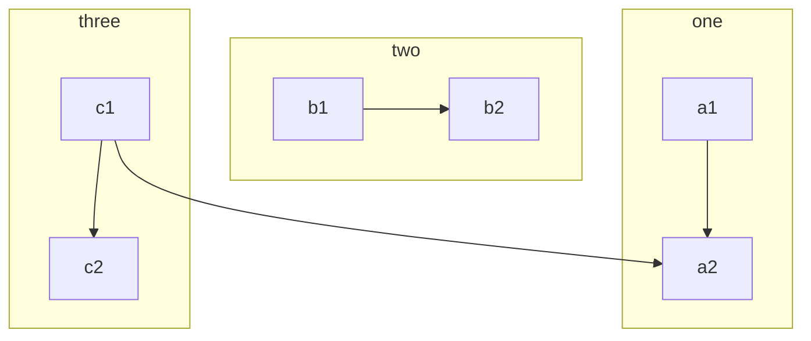
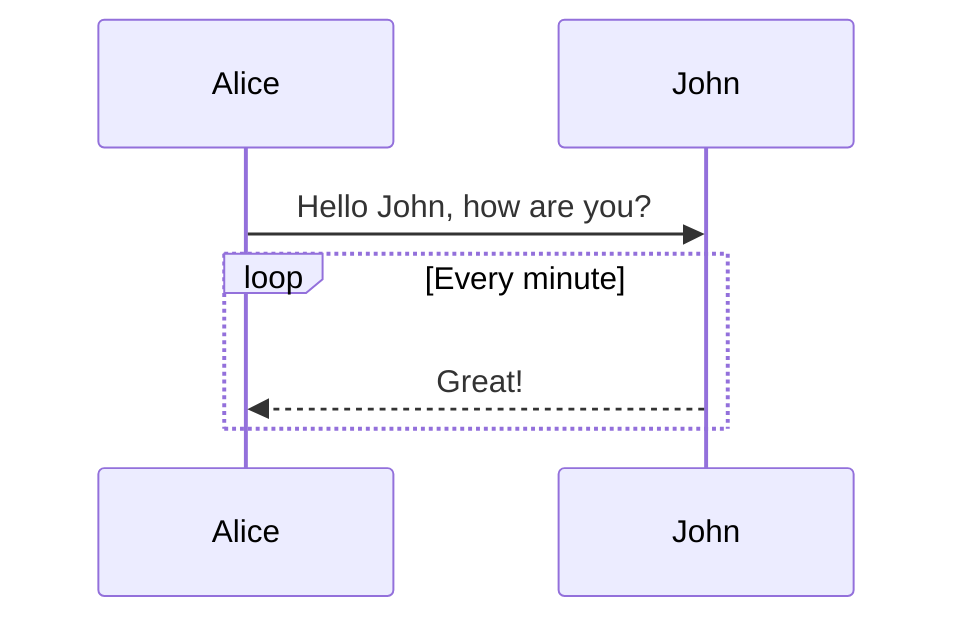
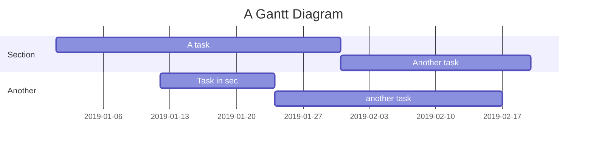
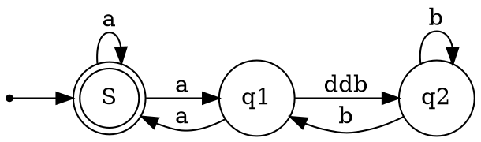

# Example Article

This is an example article to demonstrate the features of ESP32 Cube CMS.
Vditor is a **What You See Is What You Get** editor that supports *Markdown*.

* If you are not familiar with Markdown, you can use the toolbar or shortcuts for formatting
* If you are familiar with Markdown, you can format directly or switch to split preview

For more details and usage, please refer to [Vditor - Browser-based Markdown Editor](https://ld246.com/article/1549638745630). You are also welcome to give us suggestions or report issues, thank you ❤️

## Tutorial

This is an example explaining how to properly use **Markdown** for formatting. Learning this is very necessary and can make your articles clearer.

> Quoted text: Markdown is a text formatting syntax inspired

## Syntax Guide

### General Content

This section shows some formatting styles in the content, such as:

- **Bold** - `**Bold**`
- *Italic* - `*Italic*`
- ~~Strikethrough~~ - `~~Strikethrough~~`
- `Code Mark` - `` `Code Mark` ``
- [Super Link](https://ld246.com) - `[Super Link](https://ld246.com)`
- [username@gmail.com](mailto:username@gmail.com) - `[username@gmail.com](mailto:username@gmail.com)`

### Mention User

@Vanessa You can mention users in the content with `@User`, and the mentioned user will receive a system notification.

> NOTE:
> 
> 1. There needs to be a space after @username
> 2. New users do not have the permission to mention

### Emoji

Most standard emojis are supported. You can input them directly with your input method or manually enter the character format. By typing `:`, you can trigger autocomplete, and you can [set commonly used emojis](https://ld246.com/settings/function) in your personal settings.

#### Some Emoji Examples

😄 😆 😵 😭 😰 😅  😢 😤 😍 😌
👍 👎 💯 👏 🔔 🎁 ❓ 💣 ❤️ ☕️ 🌀 🙇 💋 🙏 💢

### Heading 3

You can choose to use H1 to H6, starting with ##(N). It is recommended to use Heading 3 as the top-level heading in posts or replies, not 1 or 2, because 1 is for the site level and 2 is for the post title level.

> NOTE: Don't forget there needs to be a space after #!

#### Heading 4

##### Heading 5

###### Heading 6

### Image

```


```

Supports direct upload by copy-paste.

### Code Block

#### General

```
*emphasize*    **strong**
_emphasize_    __strong__
var a = 1
```

#### Syntax Highlighting Support

If you follow the language name after ```, you can have syntax highlighting, for example:

##### Go Code Highlight Demo

```go
package main

import "fmt"

func main() {
	fmt.Println("Hello, World")
}
```

##### Java Highlight Demo

```java
public class HelloWorld {

    public static void main(String[] args) {
        System.out.println("Hello World!");
    }

}
```

> Tip: The following language names are supported: `ruby`, `python`, `js`, `html`, `erb`, `css`, `coffee`, `bash`, `json`, `yml`, `xml` ...

### Ordered, Unordered, and Task Lists

#### Unordered List

- Java
  - Spring
    - IoC
    - AOP
- Go
  - gofmt
  - Wide
- Node.js
  - Koa
  - Express

#### Ordered List

1. Node.js
   1. Express
   2. Koa
   3. Sails
2. Go
   1. gofmt
   2. Wide
3. Java
   1. Latke
   2. IDEA

#### Task List

- [x] Publish Sym
- [x] Publish Solo
- [ ] Dentist appointment

### Table

If you need to display some data, you can choose to use a table.

| header 1 | header 2 |
| -------- | -------- |
| cell 1   | cell 2   |
| cell 3   | cell 4   |
| cell 5   | cell 6   |

### Hidden Details

<details>
<summary>This is the summary part.</summary>
This is the details part.
</details>

### Paragraphs

Blank lines can be used to separate content into paragraphs for easier reading. (This is the first paragraph)

Using blank lines is quite important in Markdown formatting. (This is the second paragraph)

### Link Reference

[Link Text][Link Label]

[Link Label]: https://b3log.org

```
[Link Text][Link Label]

[Link Label]: https://b3log.org
```

### Math Formula

Multi-line formula block:

$$
\frac{1}{
  \Bigl(\sqrt{\phi \sqrt{5}}-\phi\Bigr) e^{
  \frac25 \pi}} = 1+\frac{e^{-2\pi}} {1+\frac{e^{-4\pi}} {
    1+\frac{e^{-6\pi}}
    {1+\frac{e^{-8\pi}}{1+\cdots}}
  }
}
$$

Inline formula:

Formula $a^2 + b^2 = \color{red}c^2$ is inline.

### Mind Map

```mindmap
- Tutorial
- Syntax Guide
  - General Content
  - Mention User
  - Emoji
    - Some Emoji Examples
  - Heading 3
    - Heading 4
      - Heading 5
        - Heading 6
  - Image
  - Code Block
    - General
    - Syntax Highlighting Support
      - Go Code Highlight Demo
      - Java Highlight Demo
  - Ordered, Unordered, and Task Lists
    - Unordered List
    - Ordered List
    - Task List
  - Table
  - Hidden Details
  - Paragraphs
  - Link Reference
  - Math Formula
  - Mind Map
  - Flowchart
  - Sequence Diagram
  - Gantt Chart
  - Chart
  - Musical Notation
  - Graphviz
  - Multimedia
  - Footnote
- Shortcuts
```

### Flowchart



### Sequence Diagram



### Gantt Chart



### Chart

```echarts
{
  "title": { "text": "Last 30 Days" },
  "tooltip": { "trigger": "axis", "axisPointer": { "lineStyle": { "width": 0 } } },
  "legend": { "data": ["Posts", "Users", "Replies"] },
  "xAxis": [{
      "type": "category",
      "boundaryGap": false,
      "data": ["2019-05-08","2019-05-09","2019-05-10","2019-05-11","2019-05-12","2019-05-13","2019-05-14","2019-05-15","2019-05-16","2019-05-17","2019-05-18","2019-05-19","2019-05-20","2019-05-21","2019-05-22","2019-05-23","2019-05-24","2019-05-25","2019-05-26","2019-05-27","2019-05-28","2019-05-29","2019-05-30","2019-05-31","2019-06-01","2019-06-02","2019-06-03","2019-06-04","2019-06-05","2019-06-06","2019-06-07"],
      "axisTick": { "show": false },
      "axisLine": { "show": false }
  }],
  "yAxis": [{ "type": "value", "axisTick": { "show": false }, "axisLine": { "show": false }, "splitLine": { "lineStyle": { "color": "rgba(0, 0, 0, .38)", "type": "dashed" } } }],
  "series": [
    {
      "name": "Posts", "type": "line", "smooth": true, "itemStyle": { "color": "#d23f31" }, "areaStyle": { "normal": {} }, "z": 3,
      "data": ["18","14","22","9","7","18","10","12","13","16","6","9","15","15","12","15","8","14","9","10","29","22","14","22","9","10","15","9","9","15","0"]
    },
    {
      "name": "Users", "type": "line", "smooth": true, "itemStyle": { "color": "#f1e05a" }, "areaStyle": { "normal": {} }, "z": 2,
      "data": ["31","33","30","23","16","29","23","37","41","29","16","13","39","23","38","136","89","35","22","50","57","47","36","59","14","23","46","44","51","43","0"]
    },
    {
      "name": "Replies", "type": "line", "smooth": true, "itemStyle": { "color": "#4285f4" }, "areaStyle": { "normal": {} }, "z": 1,
      "data": ["35","42","73","15","43","58","55","35","46","87","36","15","44","76","130","73","50","20","21","54","48","73","60","89","26","27","70","63","55","37","0"]
    }
  ]
}
```

### Musical Notation

```abc
X: 24
T: Clouds Thicken
C: Paul Rosen
S: Copyright 2005, Paul Rosen
M: 6/8
L: 1/8
Q: 3/8=116
R: Creepy Jig
K: Em
|:"Em"EEE E2G|"C7"_B2A G2F|"Em"EEE E2G|\
"C7"_B2A "B7"=B3|"Em"EEE E2G|
"C7"_B2A G2F|"Em"GFE "D (Bm7)"F2D|\
1"Em"E3-E3:|2"Em"E3-E2B|:"Em"e2e gfe|
"G"g2ab3|"Em"gfeg2e|"D"fedB2A|"Em"e2e gfe|\
"G"g2ab3|"Em"gfe"D"f2d|"Em"e3-e3:|
```

### Graphviz



### Flowchart

```flowchart
st=>start: Start
op=>operation: Your Operation
cond=>condition: Yes or No?
e=>end

st->op->cond
cond(yes)->e
cond(no)->op
```

### Multimedia

Supports v.qq.com, youtube.com, youku.com, coub.com, facebook.com/video, dailymotion.com, .mp4, .m4v, .ogg, .ogv, .webm, .mp3, .wav links parsing

https://v.qq.com/x/cover/zf2z0xpqcculhcz/y0016tj0qvh.html

### Footnote

This is a footnote reference[^1], and here is another footnote reference[^bignote].

[^1]: The first footnote definition.

[^bignote]: The footnote definition can use multiple paragraphs.

    Indented paragraphs are included in this footnote definition.

    ```
    You can use code blocks.
    ```

    There are also other block-level formatting syntaxes, such as **bold** and [link](https://b3log.org).

```
This is a footnote reference[^1], and here is another footnote reference[^bignote].
[^1]: The first footnote definition.
[^bignote]: The footnote definition can use multiple paragraphs.

    Indented paragraphs are included in this footnote definition.

    ```
    You can use code blocks.
    ```

    There are also other block-level formatting syntaxes, such as **bold** and [link](https://b3log.org).
```

## Shortcuts

Our editor supports many shortcuts. For details, please refer to [Keyboard Shortcuts](https://ld246.com/article/1474030007391) (or press "`?` "😼)


## File Links

[02-esp32-wifi-tutorial](02-esp32-wifi-tutorial.md)


