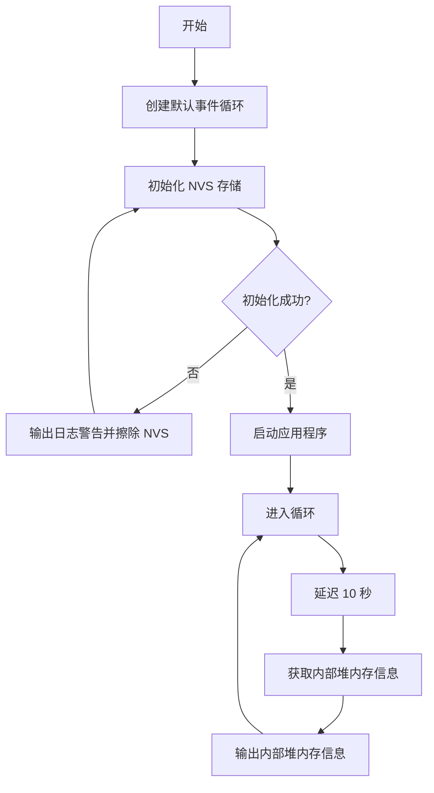

## Hardware

INMP441
![[Pasted image 20250118201558.jpeg]]

SCK -> GPIO 14 (I2S Clock)
WS -> GPIO 15 (I2S Word Select)
SD -> GPIO 32 (I2S Data)
ESP32 GND -> INMP441 GND
ESP32 VIN (3.3V) -> INMP441 VIN

## Software

```c
#include <driver/i2s.h>

#define I2S_NUM           I2S_NUM_0
#define I2S_BCK_PIN       14  // I2S Clock (SCK)
#define I2S_WS_PIN        15  // I2S Word Select (WS)
#define I2S_DO_PIN        -1  // I2S Data Out (unused)
#define I2S_DI_PIN        32  // I2S Data In (SD)

void setup() {
  Serial.begin(115200);

  // Configure I2S settings
  i2s_config_t i2s_config = {
    mode: I2S_MODE_MASTER | I2S_MODE_RX,  // Master mode, receive data
    sample_rate: 44100,                   // Audio sample rate (44.1 kHz)
    bits_per_sample: I2S_BITS_PER_SAMPLE_16BIT,  // 16-bit per sample
    channel_format: I2S_CHANNEL_FMT_ONLY_RIGHT,  // Mono data (only right channel)
    communication_format: I2S_COMM_FORMAT_I2S_MSB,  // I2S MSB format
    intr_alloc_flags: ESP_INTR_FLAG_LEVEL1,
    dma_buf_count: 8,  // Number of DMA buffers
    dma_buf_len: 64,   // Length of each buffer
  };

  // Configure I2S pin mapping
  i2s_pin_config_t pin_config = {
    bck_io_num: I2S_BCK_PIN,
    ws_io_num: I2S_WS_PIN,
    data_out_num: I2S_DO_PIN,
    data_in_num: I2S_DI_PIN
  };

  // Install I2S driver
  i2s_driver_install(I2S_NUM, &i2s_config, 0, NULL);
  i2s_set_pin(I2S_NUM, &pin_config);
  
  Serial.println("I2S setup complete");
}

void loop() {
  uint8_t i2s_data[64];  // Buffer to hold audio data

  // Read data from I2S interface
  size_t bytes_read;
  i2s_read(I2S_NUM, &i2s_data, sizeof(i2s_data), &bytes_read, portMAX_DELAY);

  // Print the number of bytes read
  Serial.print("Received bytes: ");
  Serial.println(bytes_read);

  // Process or save the audio data here as needed
}
```



